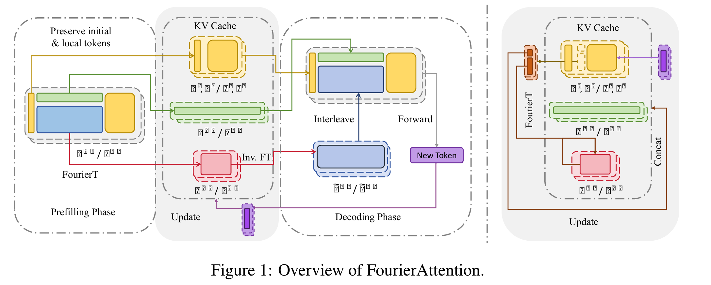
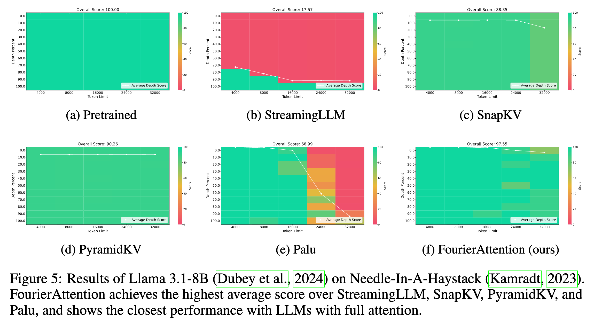
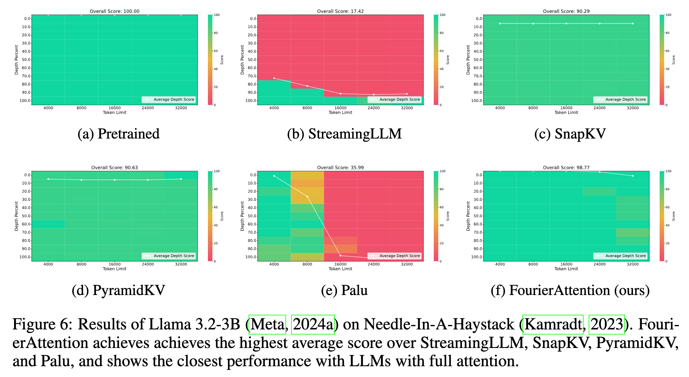
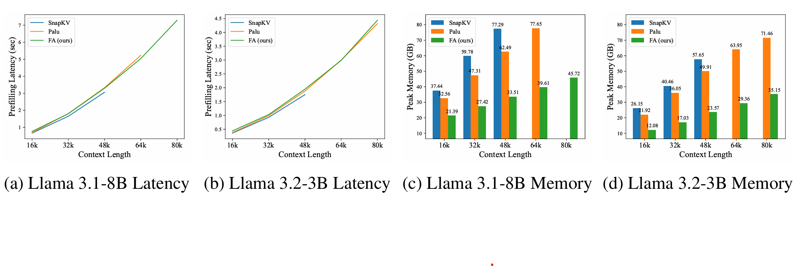

<div align="center">

<h1>Beyond Homogeneous Attention: Momory-efficient LLMs via Fourier-Approximated KV Cache</h1>

Xiaoran Liu<sup>1,2*</sup>, Siyang He<sup>1,2*</sup>, Qiqi Wang<sup>1,2*</sup>, Ruixiao Li<sup>1,2*</sup>, Yuerong Song<sup>1,2</sup>, Zhigeng Liu<sup>1,2</sup>,

Mianqiu Huang<sup>2</sup>, Zengfeng Huang<sup>1,2</sup>, Qipeng Guo<sup>2,3</sup>, Ziwei He<sup>2†</sup>, Xipeng Qiu<sup>1,2†</sup>

<sup>1</sup> Fudan Univerisity, <sup>2</sup>Shanghai Innovation Institute, <sup>3</sup>Shanghai AI Laboratory

[<a href="https://arxiv.org/abs/2506.11886">📝 Paper</a>] | [<a href="https://huggingface.co/papers/2506.11886">🤗 HF</a>] | [<a href="https://github.com/ShirleYoung/FourierAttention/">🚀 Code</a>]
</div>

## Introduction

Large Language Models struggle with memory demands from the growing Key-Value (KV) cache as context lengths increase. Existing compression methods homogenize head dimensions or rely on attention-guided token pruning, often sacrificing accuracy or introducing computational overhead. 

We propose **FourierAttention**, a training-free framework that exploits the heterogeneous roles of transformer head dimensions: lower dimensions prioritize local context, while upper ones capture long-range dependencies. By projecting the long-context-insensitive dimensions onto orthogonal Fourier bases, FourierAttention approximates their temporal evolution with fixed-length spectral coefficients. 

Evaluations on LLaMA models show FourierAttention achieves the best long-context accuracy on LongBench and Needle-In-A-Haystack (NIAH). 

Besides, a custom Triton kernel, **FlashFourierAttention**, is designed to optimize memory via streamlined read-write operations, enabling efficient deployment without performance compromise.
<p align="center">

<p>

## Installation

### Prepare Your OpenCompass

We run our downstream evaluation based on [OpenCompass](https://github.com/open-compass/opencompass).

```bash
git clone https://github.com/open-compass/opencompass
cd opencompass
pip install -e .
```

The necessary Python packages we use and their corresponding versions.

```
flash-attn==2.7.4.post1
torch==2.6.0
transformers==4.46.0
triton==3.3.0
```

### Prepare Your Model

Copy the files in folder `FourierAttention/models/` to `opencompass/models/` and change `opencompass/models/__init__.py` with our file `FourierAttention/models/__init__.py`.

## Search compressed_dims
If you want to search compressed_dims for a new model, please use your own context and execute the following command. We now have compressed_dims for Llama 3.1-8B and Llama 3.2-3B
```bash
python compressed_dims_search/compressed_dims_search.py
```

## Evaluation

Copy the folder `FourierAttention/eval/` to your OpenCompass directory and then you can try the following evaluations.

### Needle-In-A-Haystack (NIAH) evaluation

1. Add a NIAH evaluation script with customizable context length and depth. Copy `FourierAttention/needlebench/needlebench` to `opencompass/configs/datasets/needlebench` and replace `opencompass/configs/summarizers/needlebench.py` with `FourierAttention/needlebench/needlebench.py`.

2. Edit the prompt format of the RULER benchmark to enable the base model to respond more effectively by replacing `opencompass/datasets/needlebench/origin.py` with `FourierAttention/needlebench/origin.py`.

3. Execute the following command.

```bash
export PYTHONPATH=your path to FourierAttention/fourier_attn_triton
export MODEL_TYPE=fourier
python run.py eval/eval_needlebench_fourier.py --dump-eval-details -r
```

### LongBench evaluation

1. Execute the following command.

```bash
export PYTHONPATH=your path to FourierAttention/fourier_attn_triton
export MODEL_TYPE=fourier
python run.py eval/eval_longbench_fourier.py --dump-eval-details -r
```

### RULER evaluation

1. Edit the prompt format of the RULER benchmark to enable the base model to respond more effectively. In `ruler_cwe_gen.py`, `ruler_fwe_gen.py`, `ruler_niah_gen.py`, `ruler_qa_gen.py`, `ruler_vt_gen.py` under the path `opencompass/configs/datasets/ruler/`, comment out the '\n' at the end of the prompt. The following is an example in `opencompass/configs/datasets/ruler/ruler_vt_gen.py`.

```python
vt_datasets = [
    {
        'abbr': 'ruler_vt',
        'type': RulerVtDataset,
        'num_chains': 1,
        'num_hops': 4,
        'reader_cfg': dict(input_columns=['prompt'], output_column='answer'),
        'infer_cfg': dict(
            prompt_template=dict(
                type=PromptTemplate,
                template=dict(
                    round=[
                        dict(role='HUMAN', prompt='{prompt}'),
                        # dict(role='BOT', prompt='{answer}\n'),    # comment out this line
                    ]
                ),
            ),
            retriever=dict(type=ZeroRetriever),
            inferencer=dict(type=GenInferencer),
        ),
        'eval_cfg': dict(
            evaluator=dict(type=RulerVtEvaluator),
        ),
    }
]
```

2. Execute the following command.

```bash
export PYTHONPATH=your path to FourierAttention/fourier_attn_triton
export MODEL_TYPE=fourier
python run.py eval/eval_ruler4k_fourier_compare.py --dump-eval-details -r
```

### Memory and Efficient evaluation
1. Execute the following command.

```bash
export PYTHONPATH=your path to FourierAttention/fourier_attn_triton
python FourierAttention/memory_effi_throughput/llama_fourier_effi.py
python FourierAttention/memory_effi_throughput/llama_fourier_mem.py
```

## Results

<p align="center">

<p>

<p align="center">

<p>

<p align="center">

<p>

<p align="center">

<p>

## Citation

```
@article{liu2025beyond,
  title={Beyond homogeneous attention: Memory-efficient llms via fourier-approximated kv cache},
  author={Liu, Xiaoran and He, Siyang and Wang, Qiqi and Li, Ruixiao and Song, Yuerong and Liu, Zhigeng and Huang, Mianqiu and Huang, Zengfeng and Guo, Qipeng and He, Ziwei He and Qiu, Xipeng},
  journal={arXiv preprint arXiv:2506.11886},
  year={2025}
}
```
